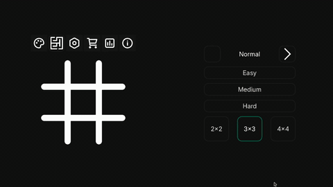
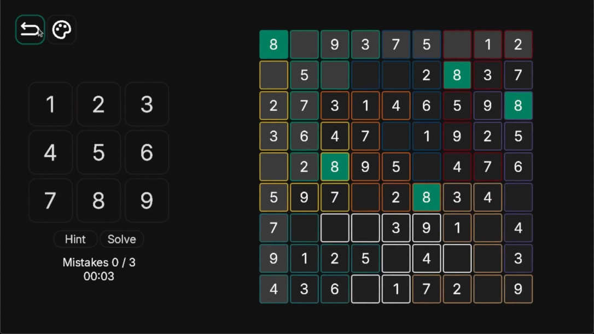
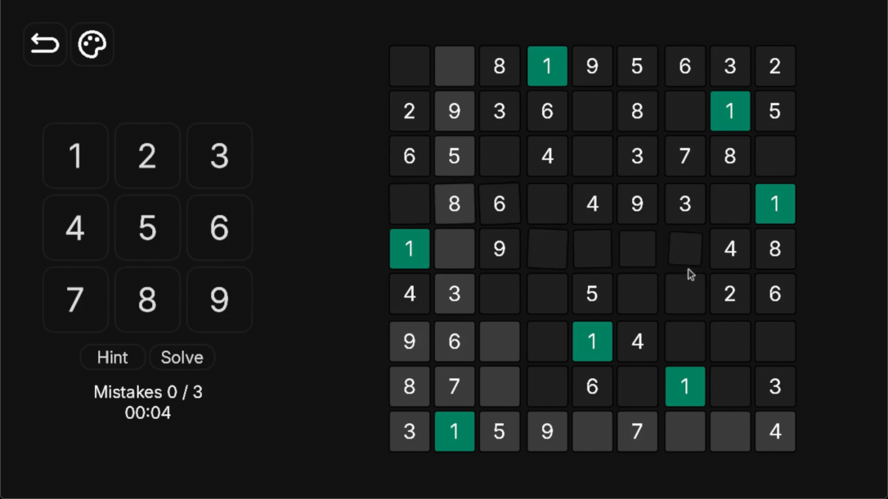
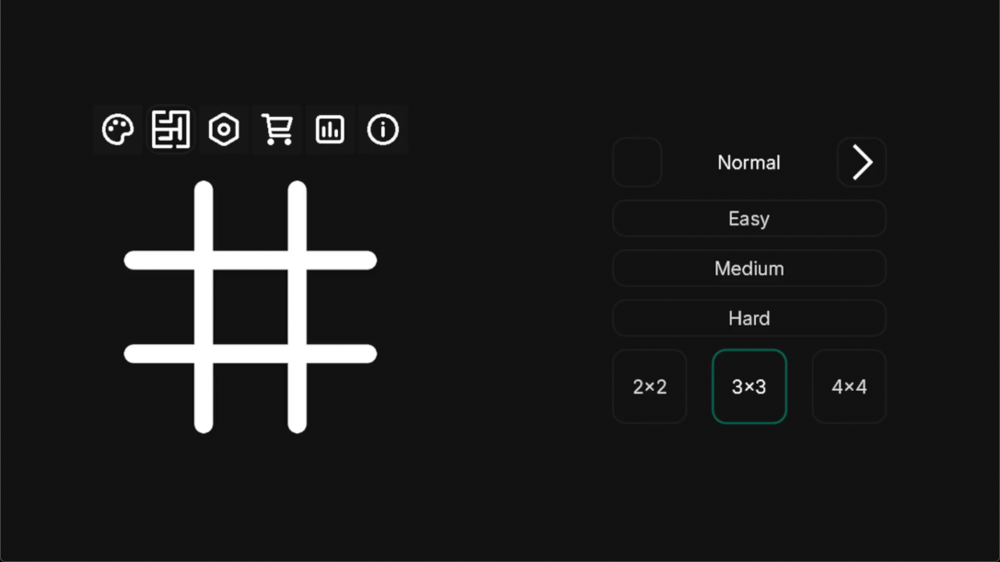

# Sudoku

A Sudoku game for desktop, built with **Godot 4.7** (GDScript).

Plays 4x4, 9x9 and 16x16 boards with either the standard boxes or **jigsaw
(irregular) regions**, across three difficulties. Puzzles are generated on the
fly, and every one of them has a single solution reachable without guessing.



|  |  |
|---|---|
|  |  |
| **Jigsaw** — regions are connected shapes, each with its own colour | **Regular** — the standard boxes, with every 1 on the board highlighted |



## What it does

- **Three board sizes** — 4x4, 9x9 and 16x16.
- **Jigsaw mode** — regions are irregular connected shapes instead of boxes,
  each drawn in its own accent colour.
- **Three difficulties**, which control both how many cells are given and how
  hard the reasoning is allowed to get.
- **Hint and solve**, a three-mistake limit and a clock.
- **Generation happens on a background thread**, so the board appears
  immediately and fills in as soon as it is ready.

## Running it

Open the project folder with Godot 4.7 or newer and press <kbd>F5</kbd>.
There is nothing to install and no plugins to enable.

The game targets **1280x720 (16:9)** and the window is resizable. Exports are
written to `build/`, which is ignored by git.

## How a puzzle is made

`SudokuBoard.generate_board(n, difficulty, zones)` is the whole generator, and
it is deliberately free of any node reference so it can be reasoned about on
its own.

1. **Regions.** With `zones = true` it starts from the standard boxes and
   swaps cells between neighbouring regions, accepting a swap only when both
   regions stay connected and keep their size.
2. **A full solution**, by backtracking over candidate bitmasks, always
   expanding the cell with the fewest candidates left.
3. **The puzzle**, by removing cells for as long as the grid keeps a *unique*
   solution and stays solvable with the techniques allowed at that difficulty
   — naked and hidden singles for easy and medium, plus naked pairs for hard.

Step 3 is the reason the puzzles are fair: a board is only accepted if it can
be reasoned out without guessing.

## Layout

```
scripts/Autoload/Settings.gd     global state: size, difficulty, saves, leaderboard
scripts/Autoload/SudokuBoard.gd  the generator and solver — no nodes, pure logic
scripts/sudoku.gd                the board on screen, and the generation thread
scripts/game.gd                  screen switching
scripts/game_ui.gd               HUD: mistakes, clock, number pad
scripts/menu.gd, popup.gd        main menu and the win/lose panels
scripts/grid_button.gd           one cell
scripts/button_animations.gd     the staggered reveal patterns
scenes/Game.tscn                 everything, in one scene
Sprites/ Font/ Resource/         assets and themes
```

## Status

Playable and complete as a game: every board size, both region modes and all
three difficulties work, and finished puzzles are always solvable.

Not done yet, and visible in the menu as icons that do nothing — options,
themes, statistics, the store and the information panel. Results are collected
in memory but there is no screen that shows them, and nothing is persisted
between runs.

## Related

The research side of this project — the ASP encoding, the dataset generator
and 2,400 published puzzles — lives in a separate repository:
**[irregular-sudoku-dataset](https://github.com/alan-pv/irregular-sudoku-dataset)**.

## License

MIT. See [LICENSE](LICENSE).
